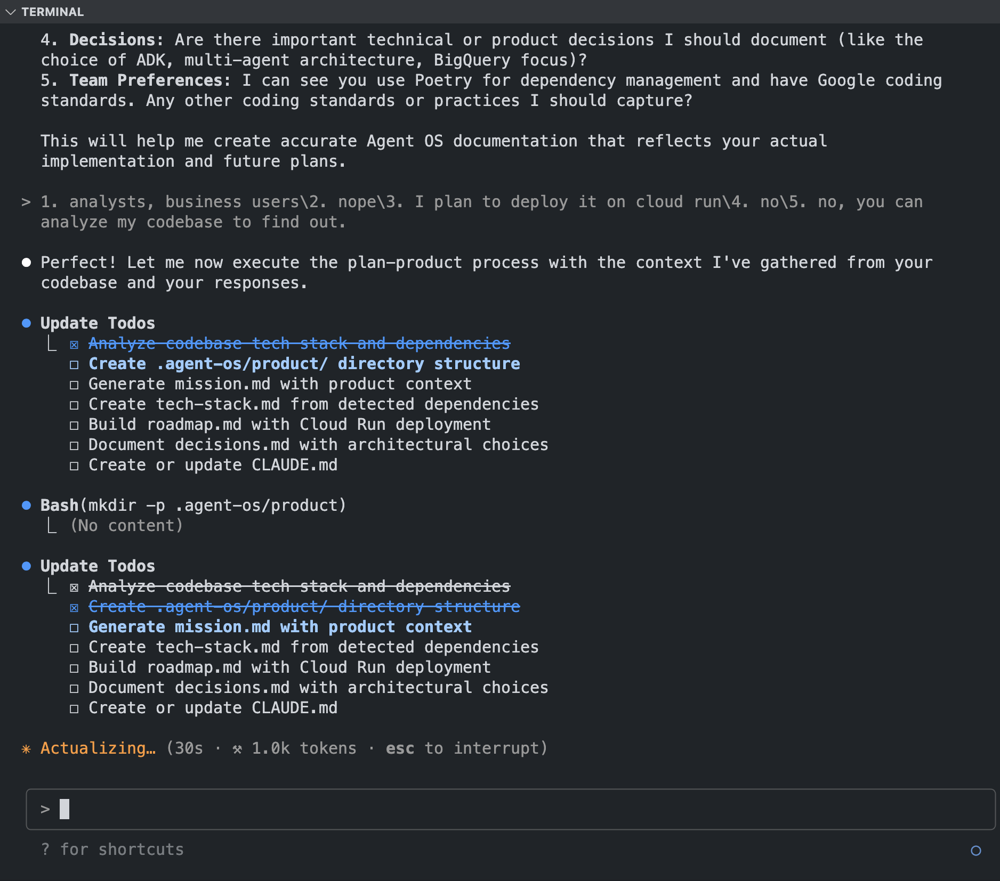
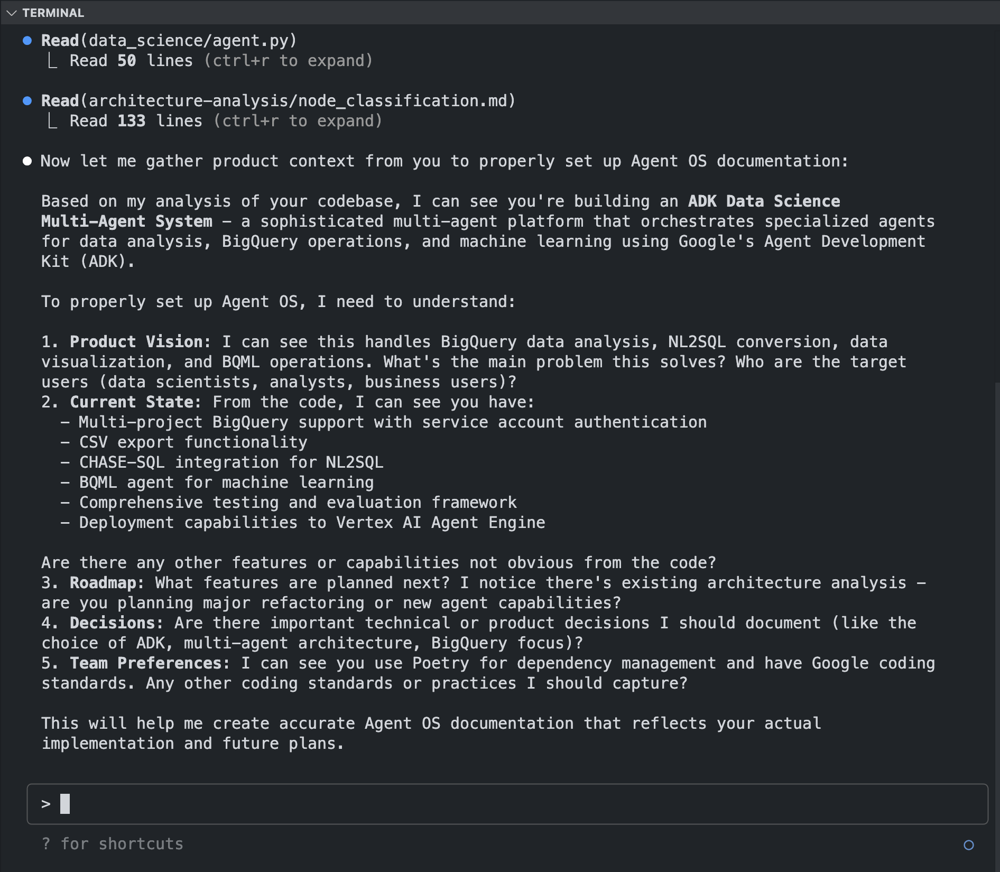

# Agent OS Adaptive

agent-os-adaptive is my optimized version of agent-os, designed to help AI agents be more "responsible" when collaborating with engineers.

It's an AI development framework that automatically adapts its approach based on code impact analysis. This is a fork of Agent OS with added leaf/core node classification to create optimal development workflows.

## 🧠 Core Innovation

**Dependency-Based Intelligent Classification**: Automatically analyzes actual code dependencies to determine optimal development approach:

- **🔍 Dependency Analysis** → Scans codebase and builds Mermaid dependency graphs  
- **📊 Quantified Classification** → Uses in-degree/out-degree metrics for precise categorization
- **🎯 Component-Level Precision** → Classifies individual functions/classes, not just features
- **🔄 Mixed Approach Support** → Handles specs spanning multiple node types with phase-based implementation

### Classification Results:
- **Leaf Node** → Autonomous AI development with E2E testing focus
- **Core Node** → Careful oversight with comprehensive testing layers  
- **Business Logic** → Standard TDD with integration testing
- **Mixed Approach** → Selective strategies per component type

Inspired by Erik Schultz's talk on [Vibe Coding](https://youtu.be/fHWFF_pnqDk?si=lzHZFO4TNMKGP7As), enhanced with data-driven dependency analysis.


## 🚀 Quick Start (same setup as agent-os)

### Prerequisites

- **Claude Code CLI** or **Cursor IDE** with Claude integration
- **Git** (recommended)

### Step 1: Clone Agent OS Adaptive

```bash
cd ~
git clone https://github.com/fredrick84823/agent-os-adaptive.git
```

### Step 2: Tool-Specific Setup
**Claude Code CLI**
```bash
curl -sSL https://raw.githubusercontent.com/buildermethods/agent-os/main/setup-claude-code.sh | bash
```

- Copies the commands from the GitHub Repo to use as custom slash commands in your ~/.claude/commands/ folder.
- Optionally installs specialized subagent files from the GitHub Repo to your ~/.claude/agents/ folder for enhanced performance.

**Cursor IDE**
```bash
curl -sSL https://raw.githubusercontent.com/buildermethods/agent-os/main/setup-cursor.sh | bash
```

- Creates the .cursor/rules/ directory in your project.
- Copies the commands from the GitHub repo to your .cursor/rules/ folder with .mdc extensions.


### Step 3: Projects Setup

#### 🆕 For New Projects (0 → 1)

1. **Create your project**
   ```bash
   mkdir my-awesome-project
   cd my-awesome-project
   git init
   ```

2. **Initialize with Agent OS**

   **Claude Code:**
   ```bash
   /plan-product
   I want to build a SaaS tool for tracking customer feedback with AI-powered insights
   ```

   **Cursor:**
   ```bash
   @plan-product
   I want to build a SaaS tool for tracking customer feedback with AI-powered insights
   ```

#### 🔄 For Existing Projects

1. **Navigate to your project**
   ```bash
   cd your-existing-project
   ```

2. **Analyze and install Agent OS**

   **Claude Code:**
   ```bash
   # agent will analyze product -> plan product -> scan codebase to generate docs
   /analyze-product
   Please analyze my codebase and set up Agent OS documentation
   ```

   **Cursor:**
   ```bash
   # agent will analyze product -> plan product -> scan codebase to generate docs
   @analyze-product
   Please analyze my codebase and set up Agent OS documentation
   ```

   **Example**:

   

### Step 4: Interactive Setup

The AI will guide you through:
- 📝 **Product Mission**: Define your vision and target users
- 🛠️ **Tech Stack**: Detect or configure your technology choices  
- 📋 **Roadmap**: Create development phases and feature priorities
- 🏗️ **Architecture Analysis**: Map dependencies (existing projects only)

   **Example**:

   

### Step 5: Start Building Features

**Claude Code:**
```bash
# Plan a new feature
/create-spec
I want to add user authentication with OAuth and email verification

# Execute development tasks  
/execute-task
Let's implement the user registration feature
```

**Cursor:**
```bash
# Plan a new feature
@create-spec
I want to add user authentication with OAuth and email verification

# Execute development tasks
@execute-task
Let's implement the user registration feature
```

### Step 6: What Gets Generated

Agent OS creates a complete project structure:

```bash
your-project/
├── agent-os-adaptive/
│   ├── product/                    # Product documentation
│   │   ├── mission.md             # Vision and goals
│   │   ├── roadmap.md             # Development phases
│   │   ├── tech-stack.md          # Technology choices
│   │   └── decisions.md           # Decision history
│   ├── architecture-analysis/     # Dependency analysis (existing projects)
│   │   ├── dependency_map.mermaid # Visual dependency graph
│   │   └── node_classification.md# Component analysis
│   └── specs/YYYY-MM-DD-feature/  # Feature specifications
│       ├── spec.md                # Requirements
│       ├── tasks.md               # Implementation tasks
│       └── sub-specs/             # Technical details
└── CLAUDE.md                      # Project-specific instructions
```

### 💡 Example Results

See a complete example of Agent OS in action or just see examples folder in this repo:
**[ADK Data Science Agent](https://github.com/fredrick84823/adk-data-science-agent/tree/main/python/agents/data-science)** - A real project built using Agent OS Adaptive showing the complete structure and documentation.

## 🎯 Detail Feature Explanation

### 🔍 Intelligent Analysis Process

The system now performs comprehensive dependency analysis to make precise classifications:

1. **Codebase Scanning** - Identifies all functions, classes, and modules
2. **Dependency Mapping** - Generates visual Mermaid dependency graphs
3. **Impact Analysis** - Calculates "blast radius" of changes
4. **Component Classification** - Uses in-degree/out-degree metrics for precise categorization

### 📊 Classification Categories

#### Leaf Nodes (Autonomous Development)
✅ **Low In-Degree, High Out-Degree**
- Few or no components depend on them
- Can be removed without breaking other features
- UI components with one-way data flow
- Report generators and exporters
- Feature-specific components

**Metrics**: In-degree ≤ 2, Out-degree ≥ 1
**Approach**: E2E-focused testing, rapid implementation, acceptable technical debt

#### Core Nodes (Careful Oversight)
⚠️ **High In-Degree, Low Out-Degree**
- Many components depend on them
- Critical path components
- Infrastructure and shared services
- Components with bidirectional dependencies

**Metrics**: In-degree ≥ 3, Out-degree ≤ 2
**Approach**: Comprehensive layer testing, architecture-first, multiple implementation modes

#### Business Logic Nodes (Standard Development)
🔄 **Medium In-Degree and Out-Degree**
- Orchestrates between core and leaf nodes
- Contains domain-specific logic
- Controllers and service layers

**Metrics**: Balanced dependency relationships
**Approach**: Standard TDD with integration testing focus

#### Mixed Approach (Component-Selective)
🎯 **Multiple Node Types in Single Spec**
- Different components require different approaches
- Phase-based implementation (core → business → leaf)
- Risk-based development prioritization

**Approach**: Selective strategies per component type

## 🔄 Enhanced Adaptive Workflow

### 1. Dependency-Based Code Analysis
- **Codebase Scanning**: Scans all project files for functions and classes
- **Dependency Mapping**: Creates visual Mermaid graphs showing component relationships
- **Impact Calculation**: Measures "blast radius" of proposed changes
- **Component Classification**: Generates detailed classification tables with metrics

### 2. Comprehensive Architecture Analysis & Node Classification
The agent generates a detailed `node_classification.md` file that provides a complete breakdown of your codebase's architecture. This file is crucial for making informed decisions about development strategies.

**Example `node_classification.md`:**

```markdown
# Node Classification Analysis

> Created: 2025-08-05
> Project: ADK Data Science Multi-Agent System

## Component Classifications

### Core Nodes (Require Careful Oversight)

| Component | Type | In-Degree | Out-Degree | Risk Level | Justification |
|-----------|------|-----------|------------|------------|---------------|
| root_agent | CLASS | 8+ | 3 | HIGH | Central orchestrator - all tools and sub-agents depend on it |
| bigquery/tools | MODULE | 6+ | 4 | HIGH | Core BigQuery operations - used by all data access functions |

### Leaf Nodes (Autonomous Development Candidates)

| Component | Type | In-Degree | Out-Degree | Risk Level | Justification |
|-----------|------|-----------|------------|------------|---------------|
| export_query_results_to_csv | FUNCTION | 1 | 3 | LOW | Feature-specific export functionality - minimal dependencies |
| list_available_projects_and_datasets | FUNCTION | 1 | 2 | LOW | Information display feature - no other components depend on it |

## Development Recommendations

### For Core Node Changes
- **Approach:** Traditional careful development with comprehensive testing
- **Testing:** Full integration test suite, performance testing

### For Leaf Node Changes
- **Approach:** Autonomous development with E2E focus
- **Testing:** End-to-end user scenarios, acceptance testing
```

This analysis also includes:
- **Visual Dependency Map**: A link to the `dependency_map.mermaid` graph.
- **Risk Assessment**: Quantified impact levels for each component.
- **Project-Level Persistence**: The analysis is stored at the project level for reuse across all feature specifications.

### 3. Intelligent Agent Delegation
- **Main Agent Analysis**: Reads architecture analysis and classifies task components
- **Smart Delegation**: Routes to specialized subagents based on node types
- **Unified Decision Making**: Centralized classification logic with transparent reasoning

### 4. Specialized Agent Execution
- **Core Node Agent** (`@subagents/core-node-agent.md`): Careful oversight with comprehensive testing
- **Leaf Node Agent** (`@subagents/leaf-node-agent.md`): Autonomous rapid implementation
- **Mixed Approach**: Phase-based delegation to appropriate agents per component

### 5. Mode Selection (Core Nodes Only)
- **Full Agent**: AI handles everything with review points
- **Agent Planning**: AI plans, user implements  
- **User-Led**: User implements, AI validates

### 6. Component-Selective Execution
Main agent delegates different components to appropriate specialized agents based on dependency analysis

## 📁 Overall Folder Structure

```
# Cloned repository structure (~/agent-os-adaptive/):
agent-os-adaptive/
├── instructions/           # Core workflow instructions
│   ├── plan-product.md    # Product initialization
│   ├── analyze-product.md # Existing codebase analysis
│   ├── analyze-node-classes.md # (NEW) Standalone, reusable node classification
│   ├── create-spec.md     # Feature specification (uses analysis)
│   └── execute-tasks.md   # Task execution (adaptive)
├── standards/             # Development standards
│   ├── tech-stack.md      # Technology preferences
│   ├── code-style.md      # Coding conventions
│   └── best-practices.md  # Workflow guidelines
└── subagents/             # Specialized agent configurations
    ├── leaf-node-agent.md # Autonomous implementation
    ├── core-node-agent.md # Oversight-heavy approach
    └── ...                # Additional utility agents

# Generated during project initialization (in your project):
agent-os-adaptive/
├── product/                       # Product-level documentation
│   ├── mission.md                # Product vision and goals
│   ├── roadmap.md                # Development phases
│   ├── tech-stack.md             # Technology choices
│   └── decisions.md              # Decision history
├── architecture-analysis/         # Project-wide analysis (NEW)
│   ├── dependency_map.mermaid    # Visual dependency graph
│   └── node_classification.md    # Component analysis table
└── specs/YYYY-MM-DD-spec-name/   # Individual feature specs
    ├── spec.md                   # Spec requirements
    ├── tasks.md                  # Implementation tasks
    └── sub-specs/                # Spec-specific technical docs
        ├── technical-spec.md     # Technical requirements
        ├── api-spec.md           # API specifications (if needed)
        ├── database-schema.md    # Database changes (if needed)
        └── tests.md              # Testing specifications
```

## 🤝 Contributing

This framework is designed to evolve with your development patterns. Contributions welcome for:
- Additional node classification criteria
- New specialized subagents
- Improved workflow automation
- New idea of workflow

## 📚 Related

- [Original Agent OS](https://github.com/buildermethods/agent-os) by Brian Casel
- [Builder Methods](https://buildermethods.com/agent-os) by Brian Casel
- [Vibe Coding Talk](https://youtu.be/fHWFF_pnqDk?si=lzHZFO4TNMKGP7As) by Erik Schultz